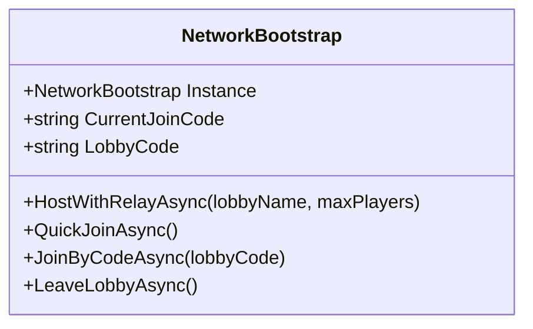
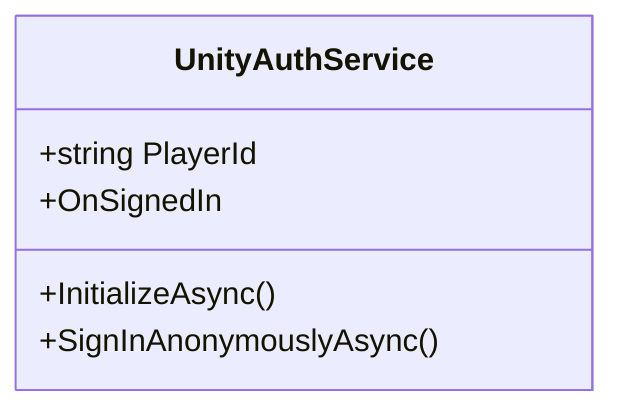
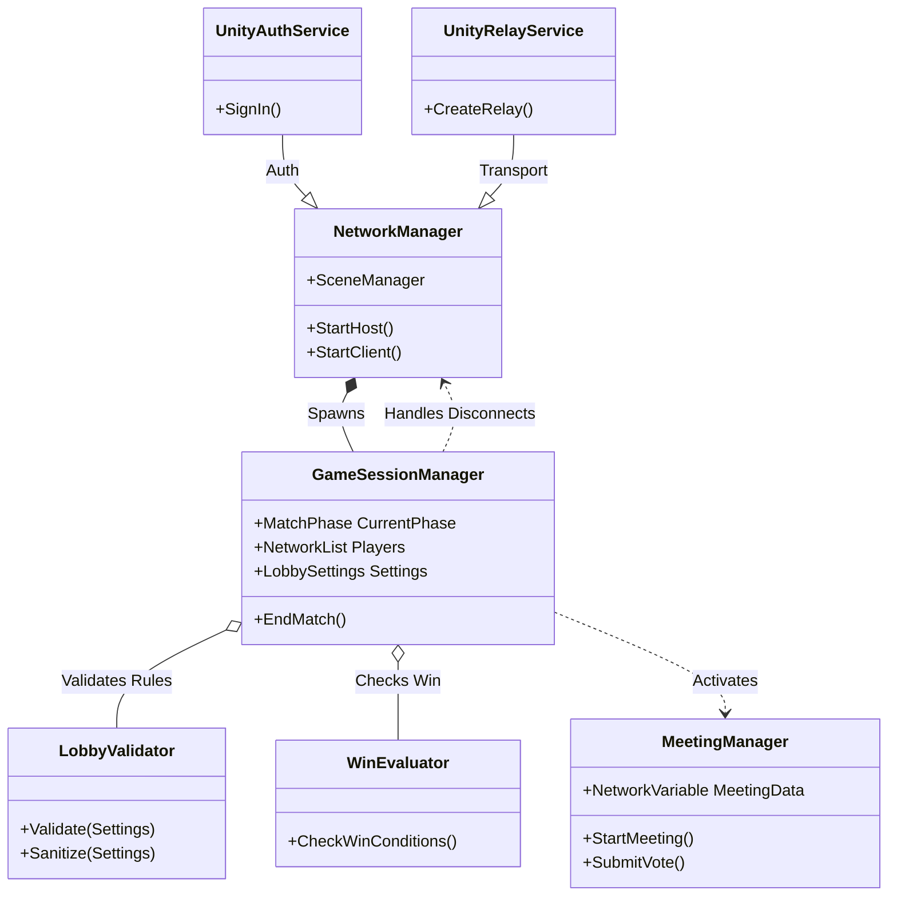
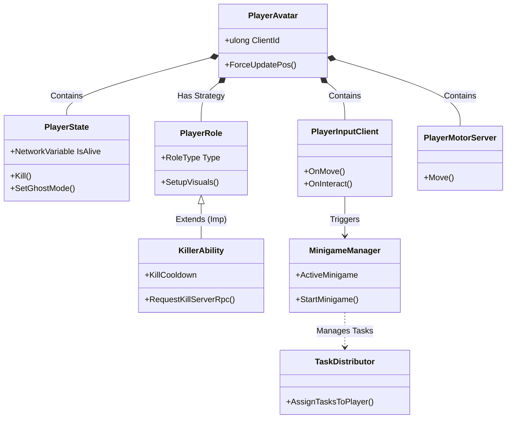
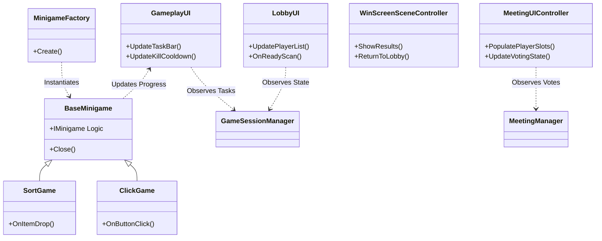

### 1.1 תיאור כללי
מערכת "Kavkazim" הינה משחק מרובה משתתפים (Multiplayer) בזמן אמת, המבוסס על ז'אנר ה-"Social Deduction". המשחק מדמה סביבה חברתית בה קבוצה של שחקנים ("Innocents") מנסה להשלים משימות, בעוד שמיעוט נסתר של שחקנים ("Kavkazi") מנסה לחבל במאמציהם ולחסל אותם מבלי להתגלות.

המערכת פותחה כיישום Desktop עבור Windows, תוך שימוש במנוע **Unity 6** ושפת **C#**. הליבה הטכנולוגית מתבססת על **Unity Netcode for GameObjects (NGO)** לארכיטקטורת שרת-לקוח. המערכת תומכת ב-4 עד 10 שחקנים במשחק יחיד.

## 1.2 טכנולוגיות וכלים (Technology Stack)
*   **מנוע גרפי**: Unity 2023.x / 6 (Render Pipeline: URP/Built-in לביצועים גרפיים בדו-ממד).
*   **שפת תכנות**: C# (.NET Standard 2.1).
*   **תשתית רשת (Networking)**:
    *   **Framework**: Unity Netcode for GameObjects (NGO).
    *   **Services**: Unity Relay (לחיבור מרחוק ללא Port Forwarding) ו-Unity Lobby (לניהול רשימת חדרים).
    *   **Transport**: Unity Transport Protocol (UTP). נבחר עקב היכולת שלו לעבור דרך Relay ולספק חיבור אמין (Reliable) ובלתי-אמין (Unreliable) על גבי UDP.
*   **ניהול גרסאות**: Git + GitHub.
*   **עריכת קוד**: Visual Studio / VS Code / Cursor.

## 1.3 ארכיטקטורת רשת (Network Topology)
המערכת פועלת במודל **Host-Client**:
*   **Host (מארח)**: המחשב של אחד השחקנים משמש גם כשרת (Server) וגם כלקוח (Client). הוא מריץ את לוגיקת המשחק, מחשב תוצאות, ומחזיק את "האמת" (State Authority).
*   **Clients (לקוחות)**: שאר השחקנים מתחברים למארח (ישירות או דרך Relay). הם שולחים קלט (Input) ומקבלים עדכוני מצב (State Updates) להצגה ויזואלית.

**יתרונות המודל:**
*   אין צורך בשרת ייעודי (Dedicated Server) יקר.
*   ניצול שירותי הענן של Unity לקישוריות קלה.

## 1.4 מחזור חיי המשחק (Game Lifecycle)
ניהול המשחק מתבצע באמצעות מכונת מצבים (State Machine) המנוהלת ב-`GameSessionManager`. כל שלב מגדיר חוקים שונים לאינטראקציה:

### 1. **Lobby Phase (שלב הלובי)**
*   **מצב**: `LobbyOpen`.
*   **פעולות**: הצטרפות שחקנים, בחירת שם, הגדרת חוקים ע"י המארח (`LobbySettings`).
*   **מעבר**: כאשר כל השחקנים לוחצים על "Ready" והמארח לוחץ "Start".

### 2. **Role Assignment (חלוקת תפקידים)**
*   **פעולות שרת**: הגרלת תפקידים (Innocent/Kavkazi) עבור השחקנים, בהתאם להגדרות הלובי (למשל, 2 רוצחים מתוך 10 שחקנים).
*   **סנכרון**: טעינת סצנת המשחק (`GameScene`) וסנכרון המיקומים ההתחלתיים.

### 3. **Gameplay Phase (שלב המשחקיות)**
*   **מצב**: `MatchInProgress`.
*   **Innocents**: מסתובבים במפה, משלימים משימות (Minigames) כדי למלא את מד המשימות.
*   **Kavkazis**: יכולים לבצע "Kill" (עם Cooldown) או "Sabotage" (חבלה במערכות).
*   **Win Check**: בדיקה מתמדת של תנאי ניצחון (האם כל המשימות הושלמו? האם מספר הרוצחים שווה למספר החפים מפשע?).

### 4. **Meeting Phase (שלב הישיבה)**
*   **מצב**: `Meeting`.
*   **טריגר**: לחיצה על כפתור חירום או דיווח על גופה.
*   **תהליך**:
    1.  **Freeze**: כל השחקנים מועברים לנקודת המפגש ואינם יכולים לזוז.
    2.  **Discussion**: צ'אט (טקסט/קול) נפתח לדיון.
    3.  **Voting**: כל שחקן בוחר במי להצביע (או Skip).
    4.  **Tallying**: השרת סופר קולות. אם יש רוב להדחה, השחקן הופך ל-Ghost.

### 5. **Wind-Down (סיום משחק)**
*   **מצב**: `PostMatch`.
*   **פעולה**: הצגת מסך ניצחון עם רשימת המנצחים.
*   **חזרה**: המתנה של X שניות או לחיצה על "Play Again" כדי לאפס את הלובי למצב `LobbyOpen`.

## 1.5 מבנה הפרויקט (Project Structure)
הקוד מאורגן בתיקיות לפי תחומי אחריות, כדי לשמור על קוד נקי ומודולרי. להלן המחלקות המרכזיות הרלוונטיות לניהול המערכת בכללותה:

### 1.5.1 NetworkBootstrap (ניהול החיבור)
מחלקה זו אחראית על אתחול שירותי הרשת, התחברות ל-Unity Relay, ויצירת הלובי הראשוני. היא משמשת כ-Entry Point לכל ה-Multiplayer Session.

### 1.5.2 UnityAuthService (אימות משתמשים)
עוטפת את שירותי האימות של Unity (UGS). מאפשרת למשתמשים להזדהות באופן אנונימי (או בעתיד דרך פלטפורמות) כדי לקבל מזהה ייחודי (PlayerId) הנחוץ ל-Lobby ול-Relay.

 

*   **`Netcode/`**: הליבה הלוגית של השרת והרשת.
    *   `GameSessionManager.cs`: ניהול מחזור החיים וה-Singleton הראשי.
    *   `Meeting/`: לוגיקת ההצבעות והישיבות (`MeetingManager`).
    *   `Player/`: לוגיקת השחקן (`PlayerState`, `PlayerMotorServer`).
    *   `Validation/`: חוקי ולידציה להגדרות הלובי (`LobbyValidator`).
    *   `WinConditions/`: בדיקת תנאי ניצחון (`WinConditionEvaluator`).
*   **`Minigames/`**: מערכת המשימות.
    *   `Base/`: מחלקות בסיס ותבניות עיצוב (Factory, Strategies).
*   **`UI/`**: ממשק המשתמש (LobbyUI, GameplayUI, MeetingUI). ה-UI הוא "טיפש" ומגיב רק לאירועים (Events) מה-Netcode.
*   **`Config/`**: נתונים סטטיים (ScriptableObjects) לאיזון המשחק.

## 1.6 תרשים ארכיטקטורה מורחב

### 1.6 תרשים ארכיטקטורה מורחב (Comprehensive Architecture)

לנוחיות הקריאה, התרשים חולק לשלושה מבטים ממוקדים (Views) המכסים את כלל רכיבי המערכת.

#### 1.6.1 מבט שרת ותשתיות (Server & Infrastructure View)
תרשים זה מתאר את הליבה הלוגית, אימות נתונים, וניהול מצב המשחק.

#### 1.6.2 מבט שחקן ומשחקיות (Player & Gameplay View)
תרשים זה מתאר את הרכב ישות השחקן (Player Entity) והאינטראקציה שלו עם העולם.

#### 1.6.3 מבט ממשק ומיני-משחקים (UI & Minigames View)
תרשים זה מתאר את שכבת התצוגה והקשר שלה ללוגיקה, ואת מערכת המיני-משחקים.

