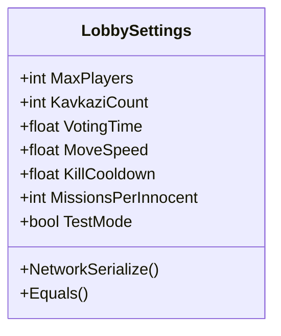
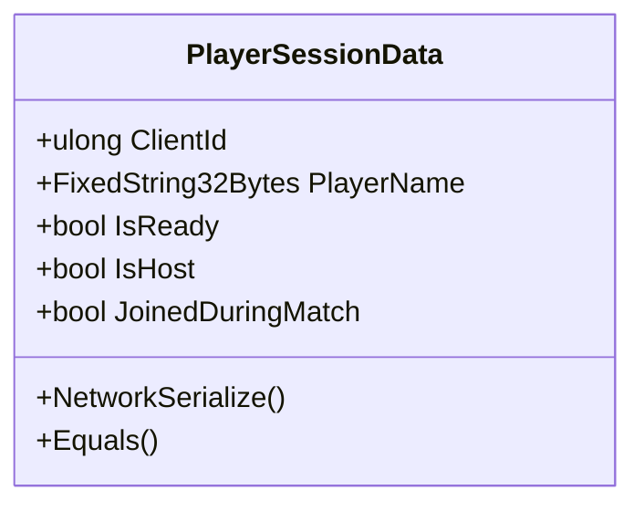
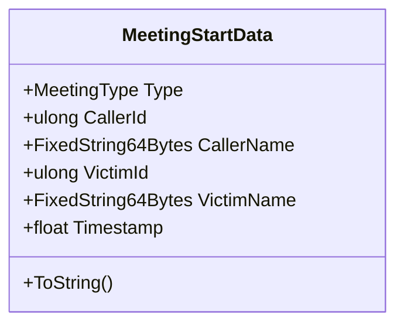
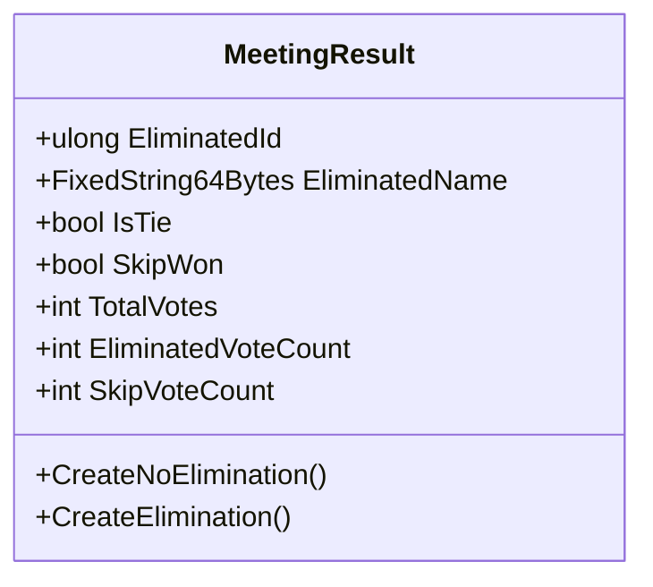
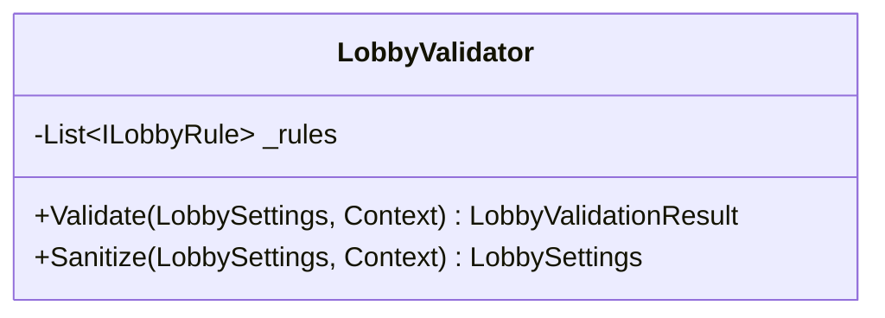
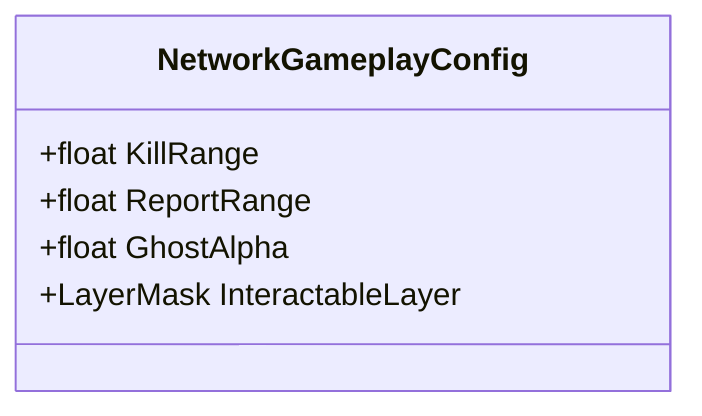
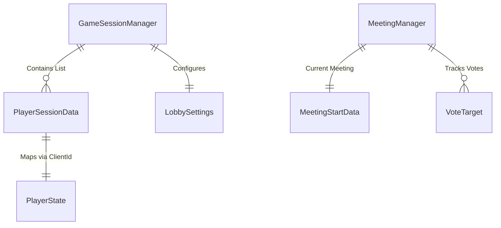

# 2. שכבת הנתונים (Data Layer)

## 2.1 סקירה כללית
בניגוד למערכות מסורתיות המבוססות על מסד נתונים מרכזי (כגון SQL), המערכת מסתמכת על ניהול מצב (State Management) בזמן אמת המסונכרן בין השרת ללקוחות. מערכת זו מבטיחה כי כל השחקנים רואים את אותה "אמת" בכל רגע נתון. הנתונים מתחלקים לשלוש קטגוריות עיקריות:
1.  **Network State**: המצב הדינמי של המשחק (מיקום, תפקידים, שלב נוכחי).
2.  **Configuration**: נתונים סטטיים והגדרות איזון (ScriptableObjects).
3.  **Local Persistence**: העדפות משתמש שנשמרות מקומית.

## 2.2 מתודולוגיית סנכרון (NetworkVariables)
המשתנים מסונכרנים באמצעות רכיב `NetworkVariable` של ספריית Mirror/Netcode for GameObjects.
*   **Server Authoritative**: רק השרת יכול לכתוב למשתנים אלו.
*   **Delta Compression**: רק שינויים נשלחים ברשת (חיסכון ברוחב פס).
*   **Late Join Support**: שחקן שמצטרף מאוחר מקבל את הערך העדכני ביותר אוטומטית.

## 2.3 ישויות נתונים מרכזיות (Entities)

### GameSessionManager (ניהול הסשן)
הלב של המערכת. אובייקט יחיד (Singleton) המכיל את כל המידע על הלובי הנוכחי.

| שם משתנה | סוג | תיאור |
| :--- | :--- | :--- |
| `CurrentPhase` | `NetworkVariable<MatchPhase>` | שלב המשחק: `LobbyOpen`, `MatchInProgress`, `Meeting`, `PostMatch`. |
| `Players` | `NetworkList<PlayerSessionData>` | רשימת כל השחקנים כולל מצב ה-Ready שלהם. |
| `Settings` | `NetworkVariable<LobbySettings>` | הגדרות המשחק הנוכחיות (ראה פירוט למטה). |
| `WinResult` | `NetworkVariable<WinResultData>` | תוצאת המשחק האחרון (מנצחים, סיבה). |

### PlayerState (מצב שחקן - Entity)
לכל שחקן יש רכיב `PlayerState` המייצג את מצבו הפיזי בעולם.

| שם משתנה | סוג | תיאור |
| :--- | :--- | :--- |
| `IsAlive` | `NetworkVariable<bool>` | בוליאני. אם `false`, השחקן הופך לרוח רפאים (Ghost), השכבה (Layer) שלו משתנה, והוא הופך לבלתי נראה לשחקנים חיים. |

### MeetingManager (ניהול ישיבות)
מנהל את הנתונים הזמניים בזמן "ישיבת חירום".

| שם משתנה | סוג | תיאור |
| :--- | :--- | :--- |
| `MeetingData` | `NetworkVariable<MeetingStartData>` | מידע התחלתי: מי לחץ על הכפתור? או מי דיווח על גופה? (ראה `MeetingStartData` להלן). |
| `VotesSubmitted` | `NetworkVariable<int>` | מונה כמה שחקנים הצביעו (לצורך סיום מוקדם). |
| `TimeRemaining` | `NetworkVariable<float>` | טיימר לסיום הישיבה. |

## 2.4 מבני נתונים מורכבים (Complex Structures)

### LobbySettings (Struct)
מכיל את חוקי המשחק (Game Rules). השרת מבצע ולידציה על כל שינוי במבנה זה כדי למנוע הגדרות בלתי חוקיות.

### PlayerSessionData (Struct)
מבנה הנתונים העיקרי לתיאור שחקן ברמת הלובי. מכיל מידע שאינו קשור לפיזיקה (כמו מיקום) אלא לזהות ולסטטוס.

### MeetingStartData (Struct)
מבנה המועבר ברשת בעת התחלת ישיבה. מכיל את כל המידע הדרוש ללקוחות כדי להציג את מסך ה-Example ("Body Found" או "Emergency Meeting").

### MeetingResult (Struct)
תוצאת ההצבעה המסונכרנת לכולם בסוף הישיבה. מכילה סיכום של ההצבעות ואת ההחלטה הסופית (מי מודח).

## 2.5 מערכת ולידציה (Data Validation Layer)
כדי למנוע מצבים לא חוקיים (למשל, יותר רוצחים משחקנים חפים מפשע), ישנה שכבת ולידציה נפרדת המיושמת ב-`LobbyValidator`.

### LobbyValidator (Class)
מחלקה לוגית שמקבלת הגדרות ומחזירה האם הן תקינות.

הולידציה מתבצעת בשני שלבים:
1.  **Sanitize (Clamp)**: תיקון אוטומטי של ערכים חריגים (למשל, אם המהירות נקבעה ל-100, היא תוגבל ל-5).
2.  **Validate**: בדיקה לוגית שמחזירה שגיאות אם החוקים נשברים.

**חוקים לדוגמה (Validation Rules):**
*   `SimpleRangeRule`: ודא שכל הערכים המספריים נמצאים בטווחים המוגדרים (למשל זמן הצבעה בין 30 ל-180 שניות).
*   `PlayerCountRules`: ודא שיש מספיק שחקנים להתחיל משחק (מינימום 2, למעט במצב TestMode).
*   `KavkaziStrictMinorityRule`: חוק קריטי – מספר הרוצחים (`KavkaziCount`) חייב להיות קטן ממספר החפים מפשע כרגע בלובי.
    *   *דוגמה*: אם יש 4 שחקנים, מותר מקסימום רוצח 1. (כי 2 רוצחים מול 2 חפים מפשע = ניצחון מיידי לרוצחים).

## 2.6 תצורת משחק (Static Configuration)
הגדרות שאינן משתנות על ידי השחקנים נשמרות ב-ScriptableObjects.

### NetworkGameplayConfig (ScriptableObject)
קובץ קונפיגורציה סטטי המגדיר קבועים למשחקיות.

## 2.7 דיאגרמת ישויות (ERD Logic)
למרות שאין DB רלציוני, הקשרים הלוגיים נשמרים בזיכרון השרת:

