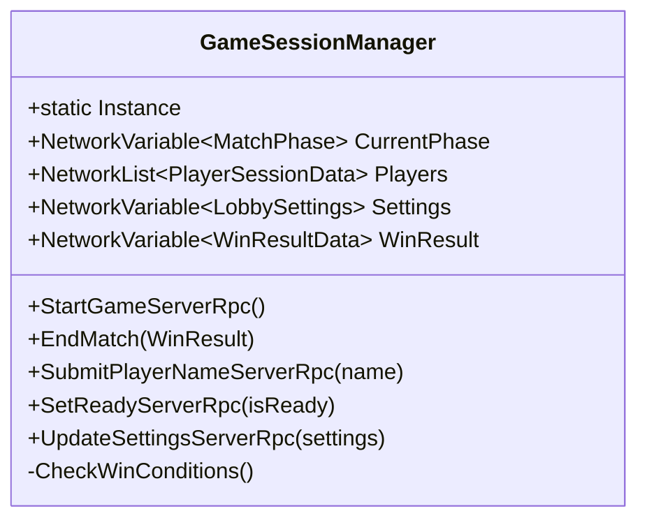
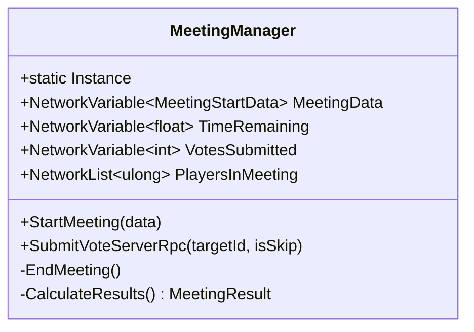
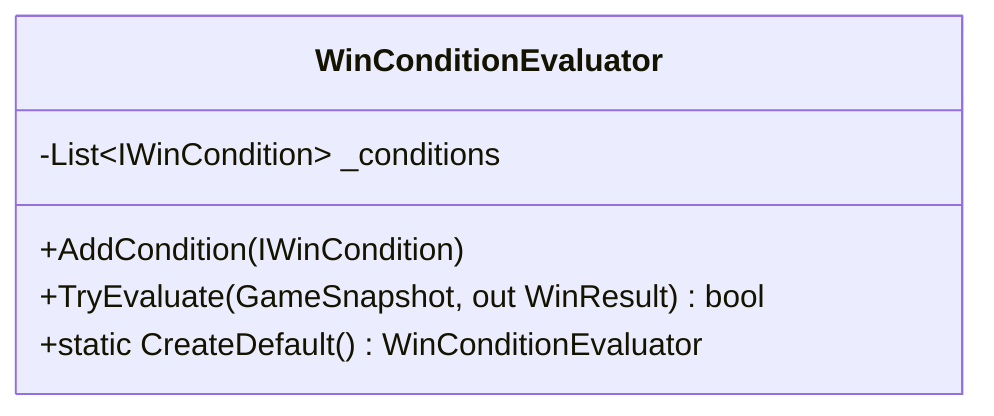
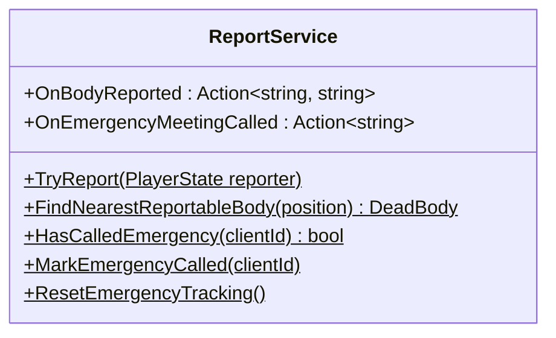
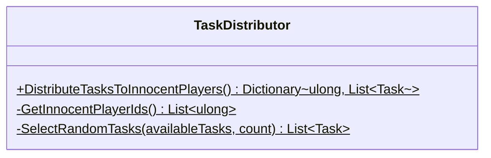
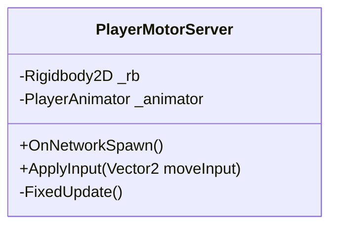
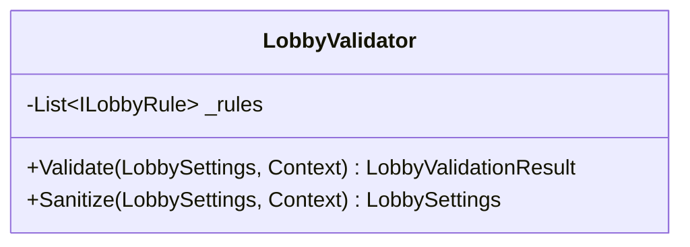
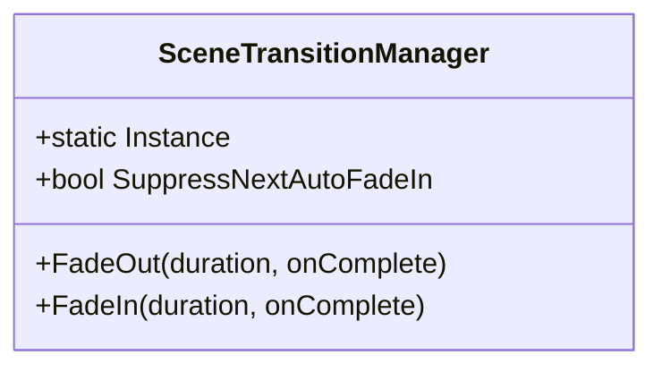
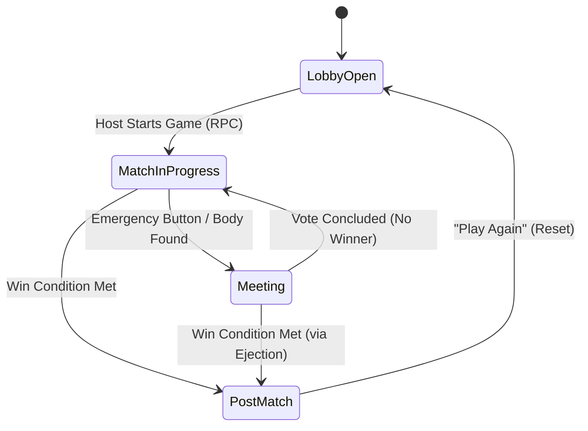

# 3. לוגיקה בצד השרת (Server-Side Logic)

## 3.1 מודל סמכותיות השרת (Authoritative Server)
במשחקי מולטיפלייר, כדי למנוע רמאויות (Cheating) ולהבטיח סנכרון תקין, השרת מחזיק ב-"אמת הבלעדית" (Single Source of Truth).
במערכת Kavkazim, ה-`GameSessionManager` משמש כרכיב הליבה המנהל את כל הלוגיקה הקריטית. כל שינוי משמעותי במשחק (הריגות, הצבעות, התחלת משחק) חייב לעבור דרכו באמצעות פקודות רשת (RPCs) ולקבל אישור מהשרת.

## 3.2 הלב של המערכת: GameSessionManager
**מיקום הקובץ**: `Netcode/GameSessionManager.cs`

מחלקה זו היא הלב הפועם של המשחק. היא מתפקדת כ-Singleton שנשאר חי בין כל הסצנות (`DontDestroyOnLoad`) ומנהלת את מחזור החיים המלא של הסשן.

### תפקידים מרכזיים:
1.  **Single Source of Truth**: מחזיקה את ה-`NetworkVariables` הקריטיים (`CurrentPhase`, `Players`, `Settings`).
2.  **State Machine**: מנהלת את המעברים בין מצבי המשחק (Lobby -> Game -> Meeting).
3.  **Event Orchestrator**: מאזינה לשינויים ברשת ומפיצה אירועים ל-UI ולמערכות אחרות.

### מתודות קריטיות (Core Core Loops)

#### `StartGameServerRpc()`
זוהי הפונקציה שמתחילה את המשחק בפועל. היא מבצעת סדרת בדיקות קפדנית לפני המעבר לשלב המשחק:
1.  **בדיקת הרשאות**: מוודאת שהקריאה הגיעה מה-Host בלבד.
2.  **בדיקת מצב**: מוודאת שהמשחק נמצא ב-`LobbyOpen`.
3.  **ולידציה**: קוראת ל-`LobbyValidator` לוודא תקינות (למשל, שיש מספיק שחקנים ושהיחס בין רוצחים לחפים מפשע תקין).
4.  **אתחול**:
    *   נועלת את הלובי.
    *   מפעילה את ה-`FadeOut` לכל הלקוחות.
    *   מחלקת תפקידים (Assign Roles).
    *   משגרת את `DelayedStartGame` שמעביר את ה-Phase ל-`MatchInProgress`.

#### `EndMatch(WinResult)`
פונקציה זו מסיימת את המשחק ומכריזה על המנצחים.
1.  **עדכון תוצאה**: מעדכנת את משתנה הרשת `WinResult` עם שמות המנצחים וסיבת הניצחון.
2.  **שינוי פאזה**: מעבירה את המשחק ל-`PostMatch`.
3.  **Cache Data**: שומרת את שמות השחקנים והתוצאות בזיכרון (כי ה-SessionManager עשוי להתאפס).
4.  **מעבר סצנה**: טוענת את סצנת ה-`WinScreen`.

### 3.2.1 מחלקות הליבה והלוגיקה (Relevant Classes)

להלן פירוט מקיף של כל המחלקות הלוגיות בצד השרת, כולל ה-Managed Singletons ומחלקות השירות הסטטיות.

### GameSessionManager (Singleton)
מנהל את ה-State המרכזי של המשחק. מחזיק את רשימת השחקנים וההגדרות, ומסנכרן את הפאזות בין כל הלקוחות. זהו ה-NetworkBehaviour הראשי שנשאר חי לאורך כל הסשן.

### MeetingManager (Singleton)
אחראי על ניהול שלב הישיבה ("Meeting Phase"). מנהל את שעון העצר, קבלת ההצבעות, וחישוב התוצאות (מי מודח).

### WinConditionEvaluator (Logic)
מחלקה לוגית (לא MonoBehaviour) האחראית על בדיקת תנאי הניצחון. מקבלת "תמונת מצב" (Snapshot) של המשחק ומחזירה האם הסתיים ומי ניצח.

### ReportService (Static Service)
שירות סטטי לניהול דיווחים (גופות או ישיבות חירום). אחראי על הלוגיקה של מציאת הגופה הקרובה, בדיקת Cooldowns, ושיגור האירוע ל-GameSessionManager להתחלת ישיבה.

### TaskDistributor (Static Logic)
מחלקה אחראית על חלוקת המשימות לשחקנים החפים מפשע (Innocents) בתחילת המשחק. היא בוחרת משימות רנדומליות מתוך ה-Trigger Points הקיימים במפה.

### PlayerMotorServer (NetworkBehaviour)
רכיב תנועה הרץ על השרת. אחראי על הזזת ה-Rigidbody2D של השחקן בצורה סמכותית וטיפול בפיזיקה (התנגשויות קיר) ובאנימציה.

### LobbyValidator (Logic)
מחלקה האחראית על אימות וטיוב (Sanitization) של הגדרות הלובי לפני תחילת המשחק, כדי למנוע מצבים בלתי אפשריים (כמו 0 שחקנים או יותר מדי רוצחים).

### Win Strategies (תנאי ניצחון ספציפיים)
מחלקות המממשות את הממשק `IWinCondition` ונבדקות לפי סדר על ידי ה-Evaluator.

**ImposterMajorityWinCondition**
בודק האם מספר הרוצחים גדול או שווה למספר החפים מפשע.
*   **לוגיקה**: `AliveKavkaziCount >= TotalAliveCount / 2`
*   **מנצחים**: Team Kavkazi.

**AllTasksCompletedWinCondition**
בודק האם כל המשימות הושלמו.
*   **לוגיקה**: `TasksLeft.Value == 0` וגם יש לפחות Innocent אחד חי.
*   **מנצחים**: Team Innocent.

**AllImpostersEliminatedWinCondition**
בודק האם כל הרוצחים הודחו.
*   **לוגיקה**: `AliveKavkaziCount == 0` וגם יש לפחות Innocent אחד חי.
*   **מנצחים**: Team Innocent.

### Infrastructure & Utilities (תשתיות)

**DisconnectHandler (MonoBehaviour)**
מטפל בהתנתקויות בלתי צפויות. אם הלקוח מזהה ניתוק מהשרת (או שהשרת קורס), הוא מחזיר את השחקן לתפריט הראשי (`MainMenu`) ומנקה את הרשת.

**SceneTransitionManager (Singleton)**
מנהל את המעברים החלקים (Fade In/Out) בין סצנות. מכיל Canvas שנשאר בין סצנות (`DontDestroyOnLoad`) ומבצע אינטרפולציה של Alpha על תמונה שחורה החוסמת Raycasts בזמן המעבר.

## 3.3 תזרים לוגי ראשי (Main Game Loop)
לוגיקת המשחק מבוססת על האזנה לשינויים (Event-Driven) במקום בדיקה כל Frame.

### 3.3.1 תרשים מעבר מצבים (State Transition Diagram)

## 3.4 ניהול מצבי המשחק (Phase Logic)

### שלב ה-Lobby (`LobbyOpen`)
*   **Ready Check**: השרת עוקב אחרי בוליאני `IsReady` לכל שחקן ב-`PlayerSessionData`.
*   **Live Validation**: בכל פעם ששחקן מצטרף או עוזב, ה-`ValidateAndClampSettings` רץ כדי לוודא שההגדרות עדיין חוקיות למספר השחקנים החדש.

### שלב ה-Gameplay (`MatchInProgress`)
בשלב זה, השרת פסיבי ומגיב לאירועים:
*   **OnPlayerKilled**: כאשר שחקן נהרג, השרת מפעיל את `CheckWinConditions` לבדוק אם המשחק נגמר.
*   **OnTaskCompleted**: כאשר משימה מסתיימת, מד המשימות מתעדכן ושוב נבדק תנאי הניצחון.

### שלב ה-Meeting (`Meeting`)
זהו תת-מערכת המנוהלת ע"י `MeetingManager`.
1.  **Snapshot**: השרת שומר תמונת מצב של כל השחקנים (מי חי, מי מת).
2.  **Scene Load**: טוען סצנה ייעודית לדיונים.
3.  **Vote Logic**: ממתין להצבעות מכל הלקוחות, מחשב רוב, ומחזיר את התוצאה ל-GameSession כדי לבצע הדחה (Kill) במידת הצורך.

## 3.5 מערכת תנאי הניצחון (Win Conditions)
המערכת משתמשת בתבנית עיצוב **Strategy Pattern** לבדיקת ניצחונות. ה-`WinConditionEvaluator` מחזיק רשימה של חוקים (`IWinCondition`) ובודק אותם לפי סדר עדיפות:

| עדיפות | שם התנאי (`WinCondition`) | לוגיקה | המנצח |
| :--- | :--- | :--- | :--- |
| **1** | `ImposterMajority` | האם מספר הרוצחים >= מספר החפים מפשע? | **Kavkazi** |
| **2** | `AllTasksCompleted` | האם מד המשימות הגיע ל-100%? | **Innocents** |
| **3** | `AllImpostersEliminated` | האם מספר הרוצחים החיים == 0? | **Innocents** |

## 3.6 טיפול בהתנתקויות (Disconnect Handling)
הסשן חייב להיות עמיד (Robust) בפני נטישת שחקנים:
1.  **Host Disconnect**: המשחק מסתיים מיידית (Host-Client architecture).
2.  **Client Disconnect**:
    *   השחקן מוסר מרשימת `Players`.
    *   הדמות שלו (`PlayerAvatar`) מושמדת (`Despawn`).
    *   **קריטי**: השרת מריץ בדיקת ניצחון מיידית. (לדוגמה: אם הרוצח האחרון התנתק, החפים מפשע מנצחים מיד).
