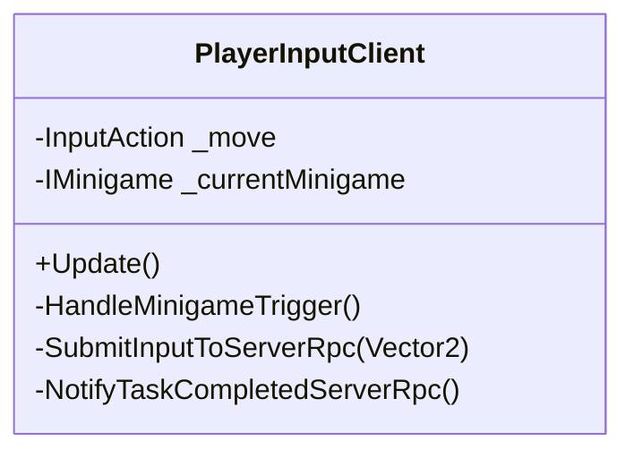
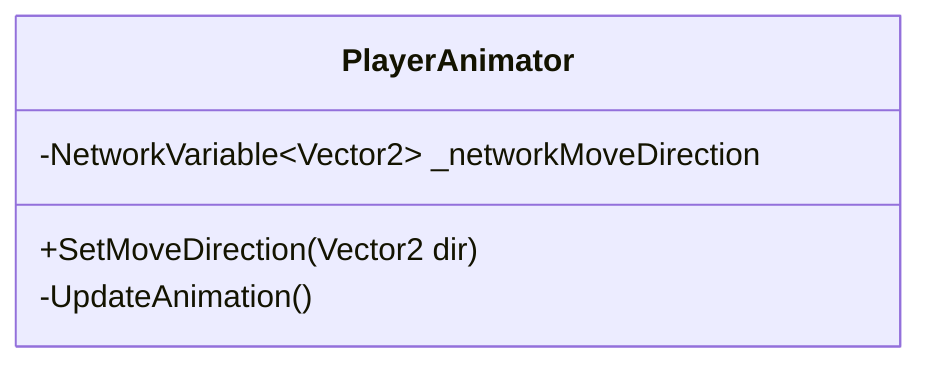
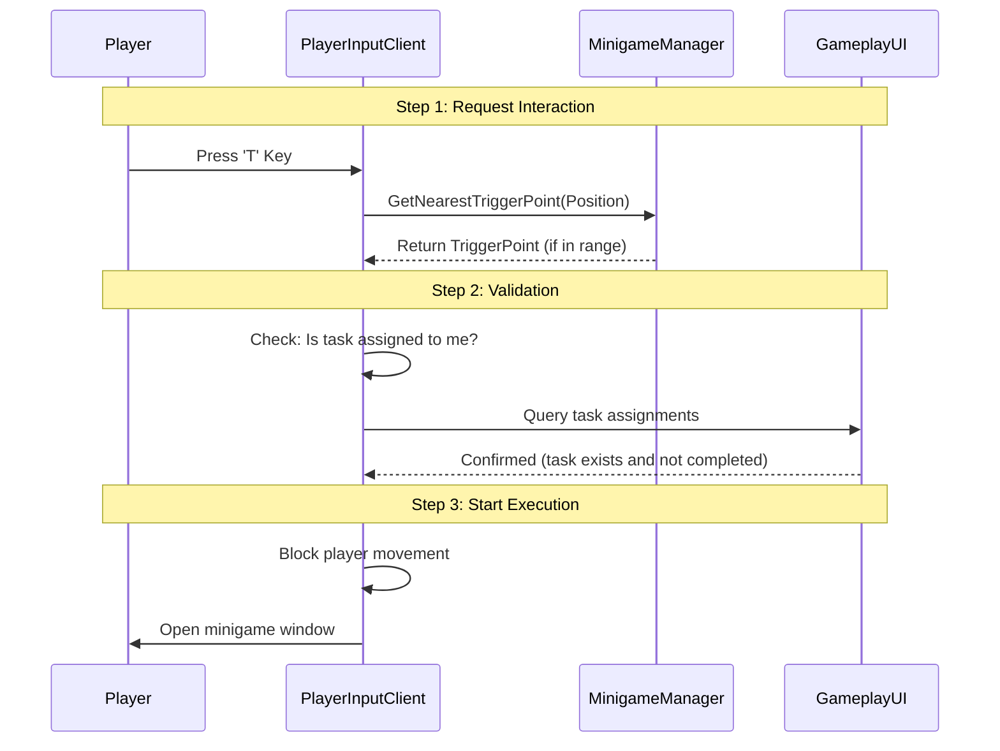

# 4. Client Logic (צד הלקוח)

פרק זה מתמקד בלוגיקה הרצה בצד הלקוח (Client-Side). מכיוון שרוב הלוגיקה החשובה מנוהלת בשרת (Server Authority), תפקידי הלקוח העיקריים הם:
1.  **איסוף קלט (Input Collection)**: קליטת פעולות השחקן (תזוזה, אינטראקציה, הצבעה) ושליחתן לשרת באמצעות RPC.
2.  **תצוגה (Visualization)**: הצגת מצב המשחק העדכני (מיקומי שחקנים, אנימציות, UI) כפי שהתקבל מהשרת (NetworkVariables).
3.  **חיזוי לקוח (Client-Side Prediction)**: במידת הצורך, ביצוע תנועה מקומית מיידית לתחושת רספונסיביות.

---

## 4.1 Player Controller (בקר שחקן)

השחקן המקומי מנוהל ע"י מספר רכיבים הפועלים יחד על ה-Player Prefab.

### 4.1.1 PlayerInputClient
מחלקה זו יורשת מ-`NetworkBehaviour` ורצה רק על הלקוח שהוא הבעלים (`IsOwner`) של אובייקט השחקן.

**תחומי אחריות:**
*   **קליטת תנועה**: קריאת וקטור תנועה מ-Unity Input System ושליחתו לשרת (`SubmitInputToServerRpc`).
*   **אינטראקציה**: זיהוי לחיצה על מקש המשימה ('T') או מקש הרג ('K').
*   **ניהול מיני-משחקים**: בדיקה מול `MinigameManager` האם יש משימה קרובה.
*   **חסימת קלט**: מניעת תזוזה בזמן שמיני-משחק פתוח או בזמן ישיבה (`Meeting`).

### 4.1.2 CameraFollow
רכיב פשוט שאחראי להיצמד לשחקן המקומי. הוא מוצא את המצלמה הראשית (`Camera.main`) ומעדכן את מיקומה בכל `LateUpdate` עם אינטרפולציה חלקה.

### 4.1.3 Player Animation System (מערכת אנימציה)
האנימציה במשחק מסונכרנת לכל הלקוחות כדי לשקף את כיוון התנועה המדויק של כל דמות.

*   **Logic (PlayerAnimator.cs)**:
    *   **Server Side**: `PlayerMotorServer` מעדכן את `PlayerAnimator.SetMoveDirection`.
    *   **Synchronization**: משתנה רשת `NetworkVariable<Vector2>` מתעדכן.
    *   **Client Side**: כל הלקוחות מאזינים ומעדכנים את ה-Animator Blend Tree.
*   **Idle State**: המערכת זוכרת את כיוון התנועה האחרון (`_lastDirection`) לכיוון עמידה.

### 4.1.4 Player State & Ghost Visibility (מצב שחקן ורוחות)
כאשר שחקן נהרג, הוא הופך ל-"רוח רפאים" (Ghost). המערכת מנהלת את הנראות שלו:

*   **PlayerState.cs**:
    *   מנהל משתנה רשת `IsAlive`.
    *   מספק מתודות `Kill()` ו-`ApplyGhostMode()` (Server-Only).
    *   משנה את שכבת הפיזיקה (Layer) של השחקן לחסימת התנגשויות עם שחקנים חיים.

*   **GhostVisibilityManager.cs**:
    *   **כללי נראות**:
        *   שחקן חי **לא רואה** רוחות רפאים.
        *   רוח רפאים **רואה** רוחות אחרות ושחקנים חיים.
    *   מנהל את ה-`Renderers` של הדמות ומסתיר אותם בהתאם למצב השחקן המקומי.

---

## 4.2 User Interface (ממשק משתמש)

מערכת ה-UI ב-Kavkazim בנויה כ-"Passive Viewer" המגיב לשינויים ב-State. אין לוגיקת משחק משמעותית ב-UI עצמו.

### 4.2.1 MainMenuUI (מסך פתיחה)
מנהל את מסך הפתיחה הראשי לפני הכניסה ללובי.

**פונקציונליות:**
*   **Host Game**: יצירת חדר חדש דרך `NetworkBootstrap.HostWithRelayAsync`.
*   **Join By Code**: הצגת Popup להזנת קוד חדר והצטרפות.
*   **Error Display**: הצגת שגיאות חיבור (Timeout, Invalid Code).

### 4.2.2 LobbyUI (מסך לובי)
מנהל את מסך ההמתנה לפני המשחק.

**פונקציונליות עיקרית:**
*   **רשימת שחקנים**: האזנה לאירוע `OnPlayersChanged` ועדכון דינמי.
*   **לוח הגדרות**: סליידרים (MaxPlayers, ImposterCount). רק ה-Host יכול לשנות.
*   **ולידציה**: הצגת שגיאות בזמן אמת באמצעות `LobbyValidator`.

### 4.2.3 GameplayUI (מסך משחק)
מנהל את ה-HUD במהלך המשחק הפעיל. זהו Singleton (`GameplayUI.Instance`).

**רכיבים פנימיים:**
| רכיב | תיאור |
|------|--------|
| **Task Bar** | מד התקדמות כללי (מבוסס על `TasksLeft`) |
| **Task List** | רשימה אישית של משימות (Innocents בלבד) |
| **Kill Cooldown** | מחוון רדיאלי (Kavkazi בלבד) |
| **ReportUIController** | כפתור דיווח על גופות (ראה 4.2.5) |

### 4.2.4 MeetingUIController (מסך ישיבה)
מנהל את מסך ההצבעות. נטען בסצנת `MeetingScene`.

*   **טיימר**: מציג את הזמן הנותר (מסונכרן מ-`MeetingManager.TimeRemaining`).
*   **הצבעות**: משתמש ב-`MeetingVoteUIController` להצגת כרטיסיות הצבעה.

### 4.2.5 ReportUIController (כפתור דיווח)
רכיב UI נפרד (לא MonoBehaviour) שמוצג ב-`GameplayUI`.

*   מציג אייקון "!" בפינה למטה-ימין.
*   משתנה לצבע כתום כאשר יש גופה בטווח (`ReportService.HasReportableInRange`).
*   חבוי לשחקנים מתים (רוחות לא יכולות לדווח).

---

## 4.3 Interaction System (מערכת אינטראקציה)

האינטראקציה מבוססת על **Minigames** (משימות) ו-**Reports** (דיווחים).

### 4.3.1 MinigameManager
Singleton לקוח שאחראי על ניהול כל ה-`MinigameTriggerPoints` במפה.

*   ב-`Awake`, הוא סורק את הסצנה ומוצא/יוצר את כל הטריגרים.
*   מספק מתודה `GetNearestTriggerPoint(position)` שמחזירה את המשימה הקרובה ביותר.

### 4.3.2 Interaction & Task Logic (לוגיקת אינטראקציה ומשימות)

תהליך ביצוע המשימה מוסבר כאן בשתי רמות:

#### א. תהליך מנקודת מבט השחקן (The Concept)
1.  השחקן מתקרב לאובייקט משימה (למשל: "מקרר").
2.  השחקן לוחץ על מקש **'T'**.
3.  **בדיקה**: המערכת בודקת האם המשימה "שייכת" לשחקן והאם הוא קרוב מספיק.
4.  **פעולה**: אם הכל תקין, נפתח חלון מיני-משחק והדמות נעצרת.

#### ב. התהליך הטכני (Technical Flow)
הלוגיקה מנוהלת ב-`PlayerInputClient.cs`:
1.  **Input**: זיהוי לחיצה על 'T'.
2.  **Search**: פניה ל-`MinigameManager.GetNearestTriggerPoint`.
3.  **Validation**: בדיקה האם הטריגר רלוונטי (`IsAssignedToLocalPlayer`).
4.  **Execution**: יצירת המיני-משחק (`MinigameFactory`) וחסימת תנועה.

