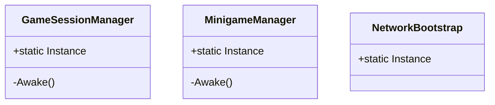
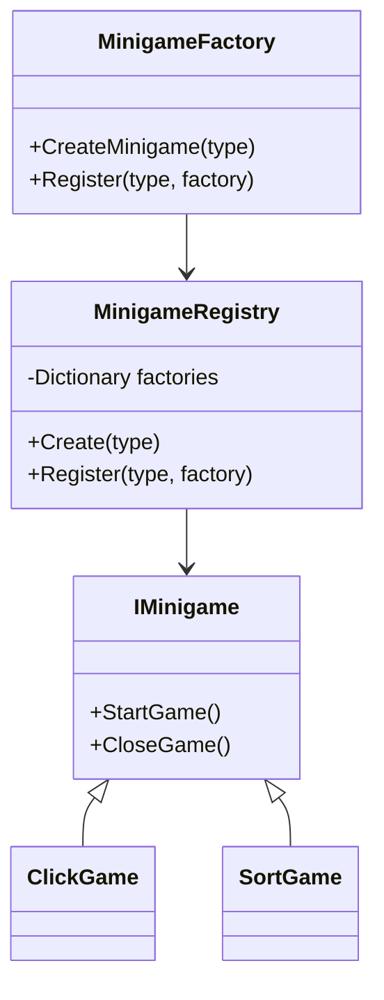
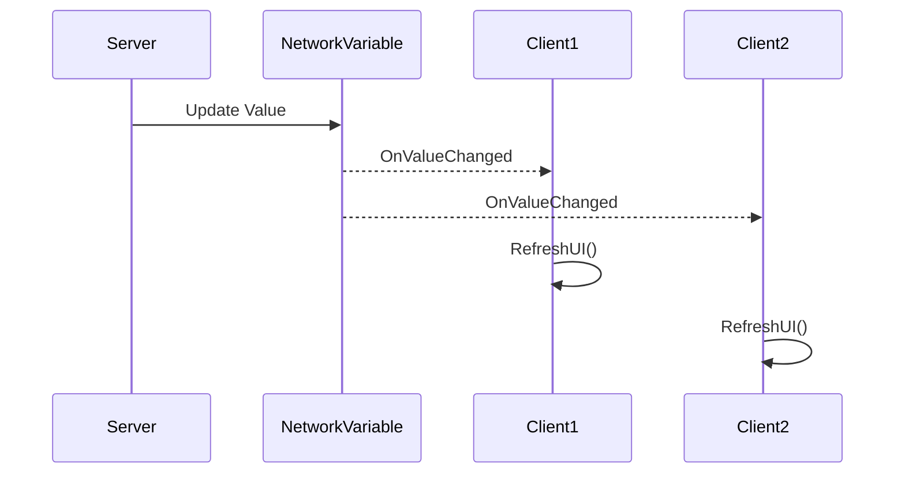
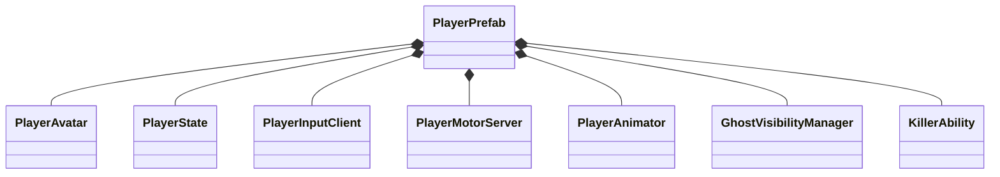
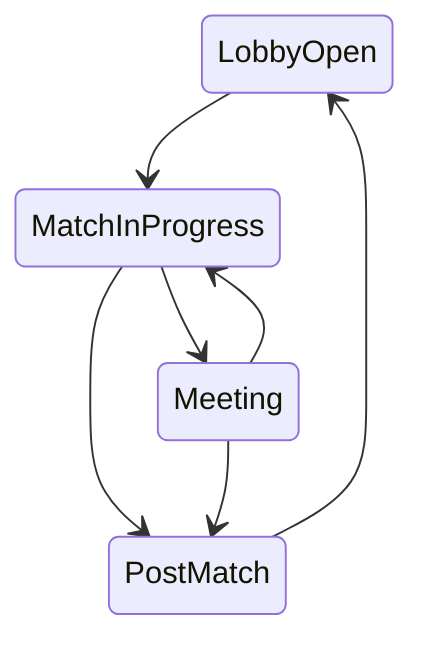

# 5. Design Patterns (תבניות עיצוב)

פרק זה מתעד את תבניות העיצוב (Design Patterns) המרכזיות המשמשות במערכת Kavkazim. השימוש בתבניות אלו מבטיח קוד מודולרי, קריא, וקל לתחזוקה.

---

## 5.1 Singleton Pattern (תבנית יחידן)

**מטרה**: להבטיח שיש מופע יחיד (Instance) של מחלקה מסוימת בכל הפרויקט, ולספק נקודת גישה גלובלית אליה.

**שימושים בפרויקט:**
| מחלקה | תחום אחריות |
|--------|--------------|
| `GameSessionManager` | ניהול מצב המשחק, שחקנים, והגדרות |
| `MinigameManager` | ניהול נקודות משימה במפה |
| `NetworkBootstrap` | ניהול חיבור רשת (Relay, Lobby) |
| `GameplayUI` | ניהול ממשק ה-HUD |
| `MeetingManager` | ניהול ישיבות והצבעות |

---

## 5.2 Factory + Registry Pattern (תבנית מפעל ורישום)

**מטרה**: יצירת אובייקטים (מיני-משחקים) לפי סוג, ללא צורך בשינוי קוד המפעל בעת הוספת סוגים חדשים.

**מימוש בפרויקט:**
*   `MinigameFactory` - מחלקה סטטית המספקת מתודה `CreateMinigame(MinigameType)`.
*   `MinigameRegistry` - מאגר פנימי הממפה `MinigameType` לפונקציית יצירה.
*   **Lazy Initialization**: ה-Registry נוצר רק בפעם הראשונה שנקראת `CreateMinigame`.

---

## 5.3 Observer Pattern (תבנית צופה)

**מטרה**: לאפשר לרכיבים "להירשם" לעדכונים על שינויי מצב, מבלי ליצור תלות הדוקה (Coupling) בין הרכיבים.

**מימוש בפרויקט:**
המערכת משתמשת בשני מנגנונים:

### א. C# Events (אירועי C#)
`GameSessionManager` מגדיר אירועים כגון `OnPlayersChanged`, `OnSettingsChanged`, ו-`OnPhaseChanged` שרכיבי UI נרשמים אליהם.

### ב. NetworkVariable Callbacks
Unity NGO מספקת מנגנון Observer מובנה דרך `OnValueChanged`. כאשר השרת מעדכן ערך, כל הלקוחות מקבלים callback אוטומטית.

---

## 5.4 Composition Pattern (תבנית הרכבה)

**מטרה**: בניית ישויות מורכבות (כמו השחקן) מרכיבים קטנים וממוקדים, במקום ירושה עמוקה.

**מימוש בפרויקט:**
ה-Player Prefab מורכב ממספר רכיבים עצמאיים:

**יתרונות:**
*   כל רכיב אחראי לתחום אחד בלבד (Single Responsibility).
*   קל להוסיף/להסיר פונקציונליות.
*   בדיקות יחידה קלות יותר.

---

## 5.5 State Machine Pattern (תבנית מכונת מצבים)

**מטרה**: ניהול מעברים לוגיים בין מצבים (Phases) של המשחק.

**מימוש בפרויקט:**
`GameSessionManager` מנהל את `MatchPhase` כ-NetworkVariable עם ארבעה מצבים: `LobbyOpen`, `MatchInProgress`, `Meeting`, `PostMatch`.

**מעברים:**
| מצב מקור | מצב יעד | טריגר |
|----------|---------|--------|
| LobbyOpen | MatchInProgress | Host לוחץ Start + All Ready |
| MatchInProgress | Meeting | דיווח על גופה / כפתור חירום |
| Meeting | MatchInProgress | סיום הצבעה |
| MatchInProgress/Meeting | PostMatch | תנאי ניצחון התמלא |
| PostMatch | LobbyOpen | לחיצה על Return to Lobby |
